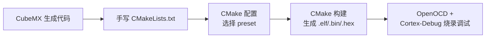

# 嵌入式 STM32 + CMake 开发完整流程

---

## 步骤 1：VS Code + 扩展

安装以下扩展：

| 扩展                          | 用途                   |
| --------------------------- | -------------------- |
| **C/C++** (Microsoft)       | 代码补全、IntelliSense、调试 |
| **CMake** (twxs)            | CMakeLists.txt 语法高亮  |
| **CMake Tools** (Microsoft) | CMake 配置/构建/调试一体化    |
| **Cortex-Debug** (marus25)  | ARM Cortex 调试支持      |

---

## 步骤 2：STM32CubeMX 生成代码

- 使用 STM32CubeMX 配置外设、时钟树
- **关键**：在 Project Manager → Toolchain/IDE 中选择 **"Makefile"**（不要选 STM32CubeIDE），这样生成的文件结构更利于 CMake 集成
- 生成后会得到 `Core/`、`Drivers/`、`Makefile`、`*.ld` 链接脚本 等

---

## 步骤 3：安装 ARM GCC 交叉编译工具链

- 下载 **ARM GNU Toolchain**（`arm-none-eabi-gcc`）：[developer.arm.com](https://developer.arm.com/downloads/-/gnu-rm)
- 安装后将 `bin/` 目录加入系统 `PATH`
- 验证安装：

```bash
arm-none-eabi-gcc --version
```

---

## 步骤 4：编写 CMake 工具链文件 (Toolchain File)

创建 `toolchain-arm-none-eabi.cmake`：

```cmake
set(CMAKE_SYSTEM_NAME Generic)
set(CMAKE_SYSTEM_PROCESSOR arm)

# 交叉编译器前缀
set(TOOLCHAIN_PREFIX arm-none-eabi-)

set(CMAKE_C_COMPILER    ${TOOLCHAIN_PREFIX}gcc)
set(CMAKE_CXX_COMPILER  ${TOOLCHAIN_PREFIX}g++)
set(CMAKE_ASM_COMPILER  ${TOOLCHAIN_PREFIX}gcc)
set(CMAKE_AR            ${TOOLCHAIN_PREFIX}gcc-ar)
set(CMAKE_OBJCOPY       ${TOOLCHAIN_PREFIX}objcopy)
set(CMAKE_OBJDUMP       ${TOOLCHAIN_PREFIX}objdump)
set(CMAKE_SIZE          ${TOOLCHAIN_PREFIX}size)

set(CMAKE_EXECUTABLE_SUFFIX_ASM   ".elf")
set(CMAKE_EXECUTABLE_SUFFIX_C     ".elf")
set(CMAKE_EXECUTABLE_SUFFIX_CXX   ".elf")

# 不使用宿主机的 libc
set(CMAKE_FIND_ROOT_PATH_MODE_PROGRAM NEVER)
set(CMAKE_FIND_ROOT_PATH_MODE_LIBRARY ONLY)
set(CMAKE_FIND_ROOT_PATH_MODE_INCLUDE ONLY)
```

---

## 步骤 5：编写 CMakeLists.txt

这是核心步骤，整合 HAL 库、启动文件、链接脚本：

```cmake
cmake_minimum_required(VERSION 3.22)
project(stm32f4xx_app C CXX ASM)

# ========== 芯片定义 ==========
set(CPU_FLAGS "-mcpu=cortex-m4 -mthumb -mfpu=fpv4-sp-d16 -mfloat-abi=hard")
add_compile_definitions(STM32F407xx USE_HAL_DRIVER)

# ========== 全局编译选项 ==========
add_compile_options(${CPU_FLAGS} -Wall -Wextra -O2 -ffunction-sections -fdata-sections)
add_link_options(${CPU_FLAGS} -Wl,--gc-sections -T${CMAKE_SOURCE_DIR}/STM32F407VGTx_FLASH.ld --specs=nosys.specs --specs=nano.specs)

# ========== HAL/LL 驱动源文件 ==========
file(GLOB_RECURSE HAL_SRCS "Drivers/STM32F4xx_HAL_Driver/Src/*.c")
file(GLOB_RECURSE CMSIS_SRCS "Core/Src/*.c")

# 排除模板文件（CubeMX 生成的非实际驱动文件）
list(FILTER HAL_SRCS EXCLUDE REGEX "_template\\.c$")

# ========== 可执行文件 ==========
add_executable(${PROJECT_NAME}
    Core/Src/main.c
    Core/Src/stm32f4xx_it.c
    Core/Src/system_stm32f4xx.c
    Core/Startup/startup_stm32f407vgtx.s   # 启动文件
    ${HAL_SRCS}
    ${CMSIS_SRCS}
)

# ========== 头文件路径 ==========
target_include_directories(${PROJECT_NAME} PRIVATE
    Core/Inc
    Drivers/STM32F4xx_HAL_Driver/Inc
    Drivers/CMSIS/Device/ST/STM32F4xx/Include
    Drivers/CMSIS/Include
)

# ========== 构建后生成 .bin / .hex ==========
add_custom_command(TARGET ${PROJECT_NAME} POST_BUILD
    COMMAND ${CMAKE_OBJCOPY} -O binary  $<TARGET_FILE:${PROJECT_NAME}> ${PROJECT_NAME}.bin
    COMMAND ${CMAKE_OBJCOPY} -O ihex   $<TARGET_FILE:${PROJECT_NAME}> ${PROJECT_NAME}.hex
    COMMAND ${CMAKE_SIZE} $<TARGET_FILE:${PROJECT_NAME}>
)
```

---

## 步骤 6：CMake Presets（可选但推荐）

创建 `CMakePresets.json`：

```json
{
    "version": 3,
    "configurePresets": [
        {
            "name": "arm-debug",
            "displayName": "ARM Debug",
            "description": "ARM GCC cross-compile (Debug)",
            "generator": "MinGW Makefiles",
            "binaryDir": "${sourceDir}/build/debug",
            "cacheVariables": {
                "CMAKE_BUILD_TYPE": "Debug",
                "CMAKE_TOOLCHAIN_FILE": "${sourceDir}/toolchain-arm-none-eabi.cmake"
            }
        },
        {
            "name": "arm-release",
            "displayName": "ARM Release",
            "generator": "MinGW Makefiles",
            "binaryDir": "${sourceDir}/build/release",
            "cacheVariables": {
                "CMAKE_BUILD_TYPE": "Release",
                "CMAKE_TOOLCHAIN_FILE": "${sourceDir}/toolchain-arm-none-eabi.cmake"
            }
        }
    ]
}
```

---

## 步骤 7：调试配置（OpenOCD + Cortex-Debug）

### 7a. 安装 OpenOCD

```bash
# MSYS2 环境下
pacman -S mingw-w64-x86_64-openocd
```

### 7b. `.vscode/launch.json` 调试配置

```json
{
    "version": "0.2.0",
    "configurations": [
        {
            "name": "Cortex Debug (ST-Link)",
            "type": "cortex-debug",
            "request": "launch",
            "servertype": "openocd",
            "cwd": "${workspaceRoot}",
            "executable": "${command:cmake.getLaunchTargetPath}",
            "device": "STM32F407VG",
            "configFiles": [
                "interface/stlink.cfg",
                "target/stm32f4x.cfg"
            ]
        }
    ]
}
```

---

## 完整工作流总结



### 常用命令速查

| 操作 | VS Code 快捷键 / 命令 |
|------|----------------------|
| 配置 CMake | `Ctrl+Shift+P` → **CMake: Configure** |
| 构建 | `Ctrl+Shift+P` → **CMake: Build**（或 F7） |
| 选择构建目标 | 底部状态栏点击目标名 |
| 启动调试 | F5 |
| 选择 Preset | 底部状态栏点击 preset 名 |

---

> ⚠️ **注意**：如果 CubeMX 重新生成代码覆盖了你的 `CMakeLists.txt`，可以将 CMake 相关文件放在单独的 `cmake/` 目录或使用 `.gitignore` 保护。建议将 CubeMX 生成的内容纳入版本控制，CMake 配置文件作为独立层叠加在上面。
