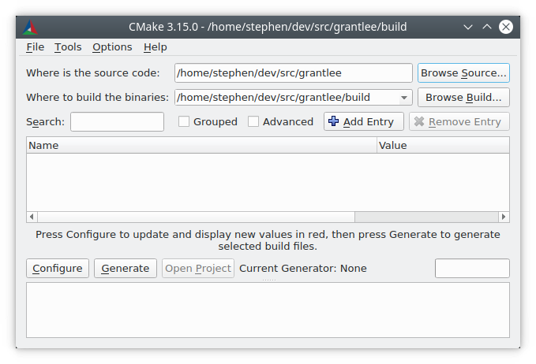
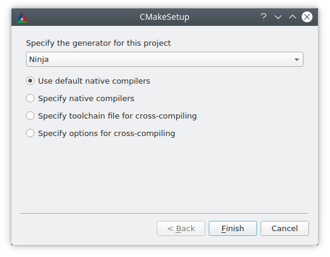
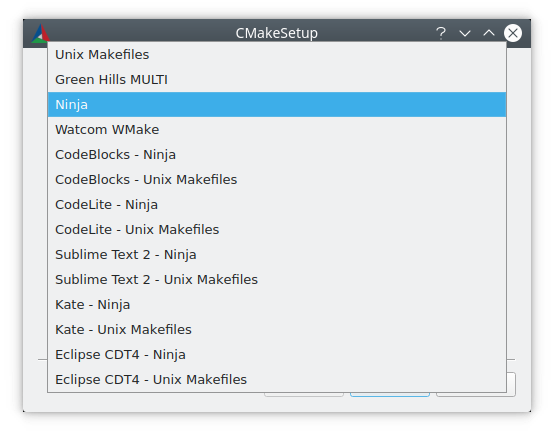
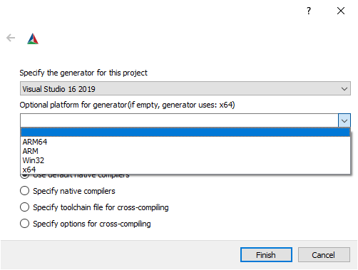
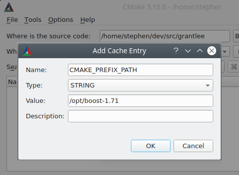

# 用户交互指南

## 目录

- 介绍
- 命令行 cmake 工具
- cmake-gui 工具
- 生成构建系统
  - 命令行环境
  - 命令行 -G 选项
  - 在 cmake-gui 中选择生成器
- 设置构建变量
  - 在命令行上设置变量
  - 使用 cmake-gui 设置变量
- CMake 缓存
- 预设
  - 在命令行上使用预设
  - 在 cmake-gui 中使用预设
- 调用构建系统
  - 选择目标
  - 指定构建程序
- 软件安装
- 运行测试

## 介绍

当软件包提供基于 CMake 的构建系统和其软件的源码时，软件使用者需要运行 CMake 用户交互工具来构建它。

行为良好的基于 CMake 的构建系统在源码目录中不会产生任何输出，因此通常用户执行源码外构建并在该目录中构建。首先，必须指示 CMake 生成合适的构建系统，然后用户调用构建工具来处理该生成的构建系统。生成的构建系统特定于用于生成它的机器，不可重新分发。每个提供源码软件包的使用者都需要使用 CMake 生成特定于其系统的构建系统。

生成的构建系统通常应视为只读。CMake 文件作为主要产物应完全指定构建系统，在生成构建系统后没有理由在 IDE 中手动填充属性。CMake 会定期重写生成的构建系统，因此用户的修改将被覆盖。

由于提供 CMake 文件，本手册中描述的功能和用户界面可用于所有基于 CMake 的构建系统。

CMake 工具在处理提供的 CMake 文件时可能会向用户报告错误，例如报告编译器不受支持、或编译器不支持所需的编译选项、或无法找到依赖项。这些错误必须由用户通过选择不同的编译器、安装依赖项或指示 CMake 在哪里找到它们等方式来解决。

## 命令行 cmake 工具

使用全新软件源码副本的 cmake(1) 简单但典型的用法是创建构建目录并在其中调用 cmake：

```bash
cd some_software-1.4.2
mkdir build
cd build
cmake .. -DCMAKE_INSTALL_PREFIX=/opt/the/prefix
cmake --build .
cmake --build . --target install
```
建议在与源码不同的目录中构建，因为这可以保持源码目录整洁，允许使用多个工具链构建单个源码，并允许通过简单删除构建目录轻松清除构建产物。

CMake 工具可能会报告针对软件提供者的警告，而不是针对软件使用者。此类警告以"This warning is for project developers"结尾。用户可以通过向 cmake(1) 传递 -Wno-author 标志来禁用此类警告。

## cmake-gui 工具

更习惯 GUI 界面的用户可以使用 cmake-gui(1) 工具来调用 CMake 并生成构建系统。

首先必须填充源码和二进制目录。始终建议使用不同的目录作为源码和构建目录。

选择源码和二进制目录

生成构建系统

有几种用户界面工具可用于从 CMake 文件生成构建系统。ccmake(1) 和 cmake-gui(1) 工具引导用户设置各种必要的选项。cmake(1) 工具可以在命令行上调用以指定选项。本手册描述使用任何用户界面工具可以设置的选项，尽管设置选项的模式对于每种工具是不同的。

## 命令行环境

当使用命令行构建系统（如 Makefiles 或 Ninja）调用 cmake(1) 时，必须使用正确的构建环境以确保构建工具可用。CMake 必须能够根据需要找到适当的构建工具、编译器、链接器和其他工具。

在 Linux 系统上，适当的工具通常在系统级位置提供，可以通过系统包管理器轻松安装。也可以由用户提供或使用安装在非默认位置的其他工具链。

交叉编译时，某些平台可能需要设置环境变量或提供设置环境的脚本。

Visual Studio 随多个命令行提示和 vcvarsall.bat 脚本一起提供，用于设置命令行构建系统的正确环境。虽然在使用 Visual Studio 生成器时不一定需要使用相应的命令行环境，但这样做没有缺点。

使用 Xcode 时，可能安装了多个 Xcode 版本。可以使用多种不同的方式选择使用哪个版本，但最常见的方法是：

- 在 Xcode IDE 的首选项中设置默认版本。
- 通过 xcode-select 命令行工具设置默认版本。
- 在运行 CMake 和构建工具时通过设置 DEVELOPER_DIR 环境变量覆盖默认版本。

为了方便，cmake-gui(1) 提供了环境变量编辑器。

## 命令行 -G 选项

CMake 默认根据平台选择生成器。通常，默认生成器足以让用户继续构建软件。

用户可以通过 -G 选项覆盖默认生成器：

```bash
cmake .. -G Ninja
```

cmake --help 的输出包含用户可选择的可用生成器列表。注意生成器名称区分大小写。

在类 Unix 系统（包括 Mac OS X）上，默认使用 Unix Makefiles 生成器。该生成器的变体也可以在各种环境中用于 Windows，例如 NMake Makefiles 和 MinGW Makefiles 生成器。这些生成器生成可以使用 make、gmake、nmake 或类似工具执行的 Makefile 变体。有关目标环境和工具的更多信息，请参阅各个生成器文档。

Ninja 生成器在所有主要平台上均可用。ninja 是一个与 make 用例相似的构建工具，但专注于性能和效率。

在 Windows 上，cmake(1) 可用于为 Visual Studio IDE 生成解决方案。Visual Studio 版本可以通过 IDE 的产品名称指定，其中包括四位年份数字。为 Visual Studio 版本的其他方式提供了别名，例如对应于 VisualC++ 编译器产品版本的两数字，或两者的组合：

```bash
cmake .. -G "Visual Studio 2019"
cmake .. -G "Visual Studio 16"
cmake .. -G "Visual Studio 16 2019"
```

Visual Studio 生成器可以针对不同的架构。可以使用 -A 选项指定目标架构：

```bash
cmake .. -G "Visual Studio 2019" -A x64
cmake .. -G "Visual Studio 16" -A ARM
cmake .. -G "Visual Studio 16 2019" -A ARM64
```

在 Apple 上，可以使用 Xcode 生成器为 Xcode IDE 生成项目文件。

一些 IDE 如 KDevelop4、QtCreator 和 CLion 原生支持基于 CMake 的构建系统。这些 IDE 提供用于选择底层生成器的用户界面，通常是在基于 Makefile 或 Ninja 的生成器之间选择。

注意，在首次调用 CMake 后，无法使用 -G 更改生成器。要更改生成器，必须删除构建目录并从头开始构建。

在生成 Visual Studio 项目和解决方案文件时，在初始运行 cmake(1) 时有几个其他选项可用。

Visual Studio 工具集可以使用 cmake -T 选项指定：

```bash
# 使用 clang-cl 工具集构建
cmake.exe .. -G "Visual Studio 16 2019" -A x64 -T ClangCL
# 针对 Windows XP 构建
cmake.exe .. -G "Visual Studio 16 2019" -A x64 -T v120_xp
```

-A 选项指定_目标_架构，-T 选项可用于指定所用工具集的详细信息。例如，-Thost=x64 可用于选择主机工具的 64 位版本。以下演示如何使用 64 位工具并针对 64 位目标架构构建：

```bash
cmake .. -G "Visual Studio 16 2019" -A x64 -Thost=x64
```

## 在 cmake-gui 中选择生成器

"Configure" 按钮触发新对话框以选择要使用的 CMake 生成器。

配置生成器

命令行上所有可用的生成器在 cmake-gui(1) 中也同样可用。

选择生成器

选择 Visual Studio 生成器时，还有其他选项可设置要生成的架构。

为 Visual Studio 生成器选择架构

## 设置构建变量

软件项目通常在调用 CMake 时需要在命令行上设置变量。下表列出了最常用的 CMake 变量：

| 变量 | 含义 |
|------|------|
| CMAKE_PREFIX_PATH | 搜索依赖包的路径 |
| CMAKE_MODULE_PATH | 搜索额外 CMake 模块的路径 |
| CMAKE_BUILD_TYPE | 构建配置，如 Debug 或 Release，决定调试/优化标志。这仅与单配置构建系统（如 Makefile 生成器和 Ninja 生成器）相关。多配置构建系统（如 Visual Studio 生成器和 Xcode）忽略此设置。 |
| CMAKE_INSTALL_PREFIX | 使用 install 构建目标安装软件的位置 |
| CMAKE_TOOLCHAIN_FILE | 包含交叉编译数据（如工具链和 sysroot）的文件。 |
| BUILD_SHARED_LIBS | 是否为未指定类型的 add_library() 命令构建共享库而非静态库 |
| CMAKE_EXPORT_COMPILE_COMMANDS | 生成 compile_commands.json 文件以供基于 clang 的工具使用 |
| CMAKE_EXPORT_BUILD_DATABASE | 生成 build_database.json 文件以供基于 clang 的工具使用 |

其他项目特定的变量可能可用于控制构建，例如启用或禁用项目的组件。

CMake 没有为不同提供的构建系统之间如何命名此类变量提供约定，除了以 CMAKE_ 为前缀的变量通常指 CMake 本身提供的选项，不应在第三方选项中使用，而应使用自己的前缀。cmake-gui(1) 工具可以按前缀定义的组显示选项，因此第三方确保使用自洽的前缀是有意义的。

## 在命令行上设置变量

CMake 变量可以在创建初始构建时在命令行上设置：

```bash
mkdir build
cd build
cmake .. -G Ninja -DCMAKE_BUILD_TYPE=Debug
```

或在后续调用 cmake(1) 时设置：

```bash
cd build
cmake . -DCMAKE_BUILD_TYPE=Debug
```

-U 标志可用于在 cmake(1) 命令行上取消设置变量：

```bash
cd build
cmake . -UMyPackage_DIR
```

最初在命令行上创建的 CMake 构建系统可以使用 cmake-gui(1) 修改，反之亦然。

cmake(1) 工具允许使用 -C 选项指定用于填充初始缓存的文件。这可用于简化需要重复相同缓存条目的命令和脚本。

## 使用 cmake-gui 设置变量

可以在 cmake-gui 中使用"Add Entry"按钮设置变量。这将触发新对话框以设置变量的值。

编辑缓存条目

cmake-gui(1) 用户界面的主视图可用于编辑现有变量。

## CMake 缓存

当 CMake 执行时，它需要找到编译器、工具和依赖项的位置。它还需要能够一致地重新生成构建系统以使用相同的编译/链接标志和依赖项路径。此类参数也需要由用户配置，因为它们是特定于用户系统的路径和选项。

首次执行时，CMake 在构建目录中生成一个 CMakeCache.txt 文件，其中包含此类产物的键值对。用户可以通过运行 cmake-gui(1) 或 ccmake(1) 工具来查看或编辑缓存文件。这些工具提供交互式界面以重新配置提供的软件并重新生成构建系统，如在编辑缓存值后所需。每个缓存条目都可以有相关的简短帮助文本，显示在用户界面工具中。

缓存条目也可以有类型以表示它应在用户界面中如何呈现。例如，类型为 BOOL 的缓存条目可以在用户界面中通过复选框编辑，STRING 可以在文本字段中编辑，FILEPATH 虽然类似于 STRING，但也应提供使用文件对话框查找文件系统路径的方式。STRING 类型的条目可以提供允许值的受限列表，然后在 cmake-gui(1) 用户界面的下拉菜单中提供（参见 STRINGS 缓存属性）。

随软件包分发的 CMake 文件也可以使用 option() 命令定义布尔切换选项。该命令创建一个具有帮助文本和默认值的缓存条目。此类缓存条目通常特定于提供的软件，影响构建配置，例如是否构建测试和示例、是否启用异常等。

## 预设

CMake 理解 CMakePresets.json 文件及其用户特定的对应文件 CMakeUserPresets.json，用于保存常用配置设置的预设。这些预设可以设置构建目录、生成器、缓存变量、环境变量和其他命令行选项。所有这些选项都可以由用户覆盖。CMake 预设格式的完整细节列在 cmake-presets(7) 手册中。

## 在命令行上使用预设

当使用 cmake(1) 命令行工具时，可以使用 --preset 选项调用预设。如果指定了 --preset，则不需要生成器和构建目录，但可以指定以覆盖它们。例如，如果你有以下的 CMakePresets.json 文件：

```json
{
  "version": 1,
  "configurePresets": [
    {
      "name": "ninja-release",
      "binaryDir": "${sourceDir}/build/${presetName}",
      "generator": "Ninja",
      "cacheVariables": {
        "CMAKE_BUILD_TYPE": "Release"
      }
    }
  ]
}
```

并且你运行以下命令：

```bash
cmake -S /path/to/source --preset=ninja-release
```

这将在 /path/to/source/build/ninja-release 中生成一个使用 Ninja 生成器且 CMAKE_BUILD_TYPE 设置为 Release 的构建目录。

如果你想查看可用预设的列表，可以运行：

```bash
cmake -S /path/to/source --list-presets
```

这将列出 /path/to/source/CMakePresets.json 和 /path/to/source/CMakeUsersPresets.json 中可用的预设，而不会生成构建树。

## 在 cmake-gui 中使用预设

如果项目有可用的预设（通过 CMakePresets.json 或 CMakeUserPresets.json），预设列表将出现在 cmake-gui(1) 中源目录和二进制目录之间的下拉菜单中。选择预设设置二进制目录、生成器、环境变量和缓存变量，但所有这些选项在选择预设后都可以被覆盖。

## 调用构建系统

生成构建系统后，可以通过调用特定的构建工具来构建软件。对于 IDE 生成器，这可能涉及将生成的项目文件加载到 IDE 中以调用构建。

CMake 知道调用构建所需的特定构建工具，因此一般来说，在生成后从命令行构建构建系统或项目，可以在构建目录中调用以下命令：

```bash
cmake --build .
```

--build 标志为 cmake(1) 工具启用特定操作模式。它调用与生成器关联的 CMAKE_MAKE_PROGRAM 命令或用户配置的构建工具。

--build 模式还接受 --target 参数以指定要构建的特定目标，例如特定的库、可执行文件或自定义目标，或特定的特殊目标如 install：

```bash
cmake --build . --target myexe
```

对于多配置生成器，--build 模式还接受 --config 参数以指定要构建的特定配置：

```bash
cmake --build . --target myexe --config Release
```

如果生成器生成特定于配置的构建系统（在调用 cmake 时使用 CMAKE_BUILD_TYPE 变量选择），则 --config 选项无效。

某些构建系统在构建期间省略已调用命令行细节。--verbose 标志可用于显示这些命令行：

```bash
cmake --build . --target myexe --verbose
```

--build 模式还可以通过在 -- 后列出它们将特定的命令行选项传递给底层构建工具。这可用于指定构建工具的选项，例如在失败作业后继续构建，而 CMake 不提供高级用户界面。

对于所有生成器，在调用 CMake 后可以运行底层构建工具。例如，在使用 Unix Makefiles 生成器生成后可以执行 make 以调用构建，或在使用 Ninja 生成器生成后执行 ninja 等。IDE 构建系统通常提供可用于构建项目的命令行工具，也可以调用。

## 选择目标

CMake 文件中描述的每个可执行文件和库都是构建目标，构建系统可以描述自定义目标，用于内部使用或用户消费，例如创建文档。

CMake 为所有提供 CMake 文件的构建系统提供一些内置目标。

| 目标 | 描述 |
|------|------|
| all | Makefile 生成器和 Ninja 生成器使用的默认目标。构建构建系统中除那些通过其 EXCLUDE_FROM_ALL 目标属性或 EXCLUDE_FROM_ALL 目录属性排除的目标之外的所有目标。Xcode 和 Visual Studio 生成器对此使用 ALL_BUILD 名称。 |
| help | 列出可用于构建的目标。此目标在使用 Makefile 生成器或 Ninja 生成器时可用，确切输出特定于工具。 |
| clean | 删除构建的对象文件和其他输出文件。Makefile 生成器为每个目录创建 clean 目标，以便可以清理单个目录。Ninja 工具提供自己的细粒度 -t clean 系统。 |
| test | 运行测试。此目标仅在 CMake 文件提供基于 CTest 的测试时自动可用。另请参阅运行测试。 |
| install | 安装软件。此目标仅在软件使用 install() 命令定义安装规则时自动可用。另请参阅软件安装。 |
| package | 创建二进制包。此目标仅在 CMake 文件提供基于 CPack 的包时自动可用。 |
| package_source | 创建源包。此目标仅在 CMake 文件提供基于 CPack 的包时自动可用。 |

对于 Makefile 生成器，提供二进制构建目标的 /fast 变体。/fast 变体用于构建指定目标而不考虑其依赖项。不检查依赖项，如果过期也不重建。Ninja 生成器在依赖项检查方面足够快，因此不为该生成器提供此类目标。

Makefile 生成器还提供用于预处理、汇编和编译特定目录中单个文件的构建目标。

```bash
make foo.cpp.i
make foo.cpp.s
make foo.cpp.o
```

文件扩展名内置在目标名称中，因为可能存在同名但扩展名不同的其他文件。但是，也提供不带文件扩展名的构建目标。

```bash
make foo.i
make foo.s
make foo.o
```

在包含 foo.c 和 foo.cpp 的构建系统中，构建 foo.i 目标将预处理两个文件。

## 指定构建程序

由 --build 模式调用的程序由 CMAKE_MAKE_PROGRAM 变量确定。对于大多数生成器，不需要配置特定程序。

| 生成器 | 默认 make 程序 | 替代方案 |
|--------|----------------|----------|
| XCode | xcodebuild | |
| Unix Makefiles | make | |
| NMake Makefiles | nmake | jom |
| NMake Makefiles JOM | jom | nmake |
| MinGW Makefiles | mingw32-make | |
| MSYS Makefiles | make | |
| Ninja | ninja | |
| Visual Studio | msbuild | |
| Watcom WMake | wmake | |

jom 工具能够读取 NMake 风格的 makefile 并并行构建，而 nmake 工具始终串行构建。使用 NMake Makefiles 生成器生成后，用户可以运行 jom 而不是 nmake。如果使用 NMake Makefiles 生成器时将 CMAKE_MAKE_PROGRAM 设置为 jom，--build 模式也将使用 jom，为了方便，提供了 NMake Makefiles JOM 生成器以正常方式查找 jom 并将其用作 CMAKE_MAKE_PROGRAM。为完整起见，nmake 是可以处理 NMake Makefiles JOM 生成器输出的替代工具，但这样做会降低性能。

## 软件安装

可以在 CMake 缓存中设置 CMAKE_INSTALL_PREFIX 变量以指定安装提供软件的位置。如果提供的软件有使用 install() 命令指定的安装规则，它们将安装产物到该前缀。在 Windows 上，默认安装位置对应于可能特定于架构的 ProgramFiles 系统目录。在 Unix 主机上，/usr/local 是默认安装位置。

CMAKE_INSTALL_PREFIX 变量始终引用目标文件系统上的安装前缀。

在交叉编译或打包场景中，如果 sysroot 是只读的或 sysroot 应保持原样，可以将 CMAKE_STAGING_PREFIX 变量设置为实际安装文件的位置。

以下命令：

```bash
cmake .. -DCMAKE_INSTALL_PREFIX=/usr/local \
  -DCMAKE_SYSROOT=$HOME/root \
  -DCMAKE_STAGING_PREFIX=/tmp/package
cmake --build .
cmake --build . --target install
```

导致文件安装在主机机器上的路径，例如 /tmp/package/lib/libfoo.so。主机机器上的 /usr/local 位置不受影响。

一些提供的软件可能指定取消安装规则，但 CMake 默认本身不生成此类规则。

## 运行测试

ctest(1) 工具随 CMake 分发一起提供以执行提供的测试并报告结果。测试构建目标用于运行所有可用测试，但 ctest(1) 工具允许对要运行哪些测试、如何运行以及报告结果进行细粒度控制。在构建目录中执行 ctest(1) 等价于运行测试目标：

```bash
ctest
```

可以传递正则表达式以仅运行匹配表达式的测试。要仅运行名称中包含 Qt 的测试：

```bash
ctest -R Qt
```

也可以通过正则表达式排除测试。要仅运行名称中不包含 Qt 的测试：

```bash
ctest -E Qt
```

可以通过向 ctest(1) 传递 -j 参数来并行运行测试：

```bash
ctest -R Qt -j8
```

 alternatively，可以设置环境变量 CTEST_PARALLEL_LEVEL 以避免需要传递 -j。

默认情况下 ctest(1) 不打印测试输出。命令行参数 -V（或 --verbose）启用详细模式以打印所有测试的输出。--output-on-failure 选项仅打印失败测试的输出。可以将环境变量 CTEST_OUTPUT_ON_FAILURE 设置为 1 作为向 ctest(1) 传递 --output-on-failure 选项的替代。
```
